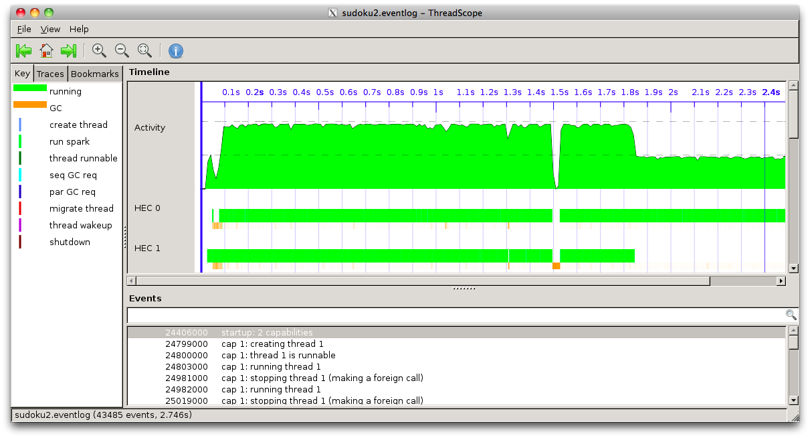
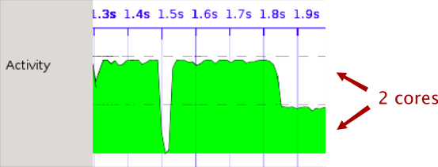
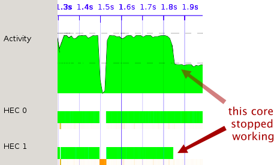
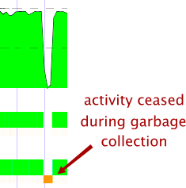

Objectives
---------
Examine a ThreadScope profile on a realistic program

Concepts
--------
1. HEC - Haskell Execution Context; basically there is one HEC for each core
   you enable with the RTS option `-N`

Steps
-----
1.    Build sudoku2 and view its eventlog in ThreadScope

        rm sudoku2
        ghc -O2 sudoku2.hs -threaded -rtsopts -eventlog
        ./sudoku2 sudoku17.1000.txt +RTS -N2 -ls
        threadscope sudoku2.eventlog

2.    Examine the activity graph.  The dashed horizontal lines provide hints About
      the amount of activity you might expect.  Here for example we are using two
      cores, which is reflected the line dividing the graph into two pieces.

      

      In the example above, we can see both cores nearly maxed out until around
      1.85s at which point the amount of activity drops down to half.

3.    To see how this activity is distributed between cores, have a look at the
      HECs just below.

      

      It so happens that the reason the activity dropped in half is that one of
      the cores stopped working.

4.    Observe the link between activity and garbage collection.

      

Questions and exercises
-----------------------
1.    What do you think is causing the uneven division between the 2 cores?

1.    If you have more than 2 course available, what happened when you enable
      them?

1.    Try profiling the k-means example and studying the profile.
