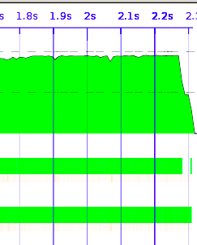

Objectives
----------

Concepts
--------

Steps
-----
1.    Build sudoku3, generating statistics and a ThreadScope profile

        rm sudoku3
        ghc -O2 sudoku3.hs -threaded -rtsopts -eventlog
        ./sudoku3 sudoku17.1000.txt +RTS -s -N2 -ls

2.    Examine the statistics, againg focusing on the sparks and timing 
      block

        SPARKS: 1000 (1000 converted, 0 pruned)

        INIT  time    0.00s  (  0.01s elapsed)
        MUT   time    3.61s  (  2.17s elapsed)
        GC    time    0.62s  (  0.14s elapsed)
        EXIT  time    0.00s  (  0.00s elapsed)
        Total time    4.23s  (  2.31s elapsed)

       Note the change in total time and notice also that we are now generating
       a lot more sparks than before (see [Parallel and Concurrent Programming
       in Haskell][ph-tutorial] for details on why)

3.    Now examine the ThreadScope profile for the improved sudoku

        threadscope ./sudoku3.eventlog

4.    Notice how this version of the sudoku solver uses both cores all the way
      up to the end

      

Questions and exercises
-----------------------
1.    If you have more than 2 course available, what happened when you enable
      them?

[ph-tutorial]: http://community.haskell.org/~simonmar/par-tutorial.pdf
