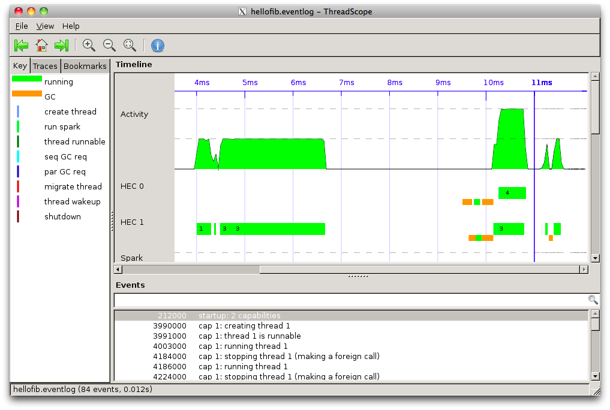

Objective
---------
Run ThreadScope on a sample program and get a trace.

Steps
-----
1. Copy the following parallel code to hellofib.hs

         import Control.Parallel.Strategies
         import System.Environment

         fib 0 = 1
         fib 1 = 1
         fib n = runEval $ do
           x <- rpar (fib (n-1))
           y <- rseq (fib (n-2))
           return (x + y + 1)

         main = do
           args <- getArgs
           n <- case args of
                 []    -> return 20 
                 [x]   -> return (read x)
                 _     -> fail ("Usage: hellofib [n]")
           print (fib n)

1. Build hellofib.hs

         ghc -O2 -rtsopts -eventlog -threaded hellofib

1. Run hellofib

         ./hellofib +RTS -N2

1. View its trace

        threadscope hellofib.eventlog # on Windows, hellofib.exe.eventlog

Follow the [installation instructions](ThreadScope#Installing_ThreadScope) on
the ThreadScope homepage
